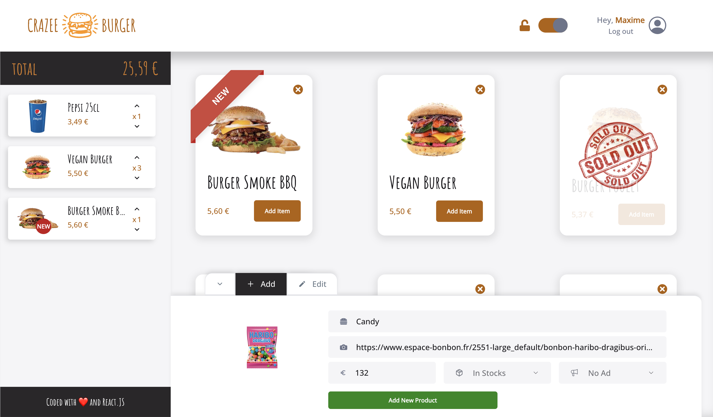

# Crazee Burger

Responsive web app for customers to browse and select food from a menu.
Admins can efficiently manage menu items using straightforward CRUD (Create, Read, Update, Delete) functionality.

## Demo

🌱 > [crazee-burger live demo](https://crazee-burger-maxdnc.vercel.app/)

## Preview

## Technologies used:

- React
- Styled-Components
- GIT
- Github
- Javascript
- SCSS
- Firebase
- Vite
- Vercel

## Authors

- [@maxdnc](https://github.com/maxdnc)
